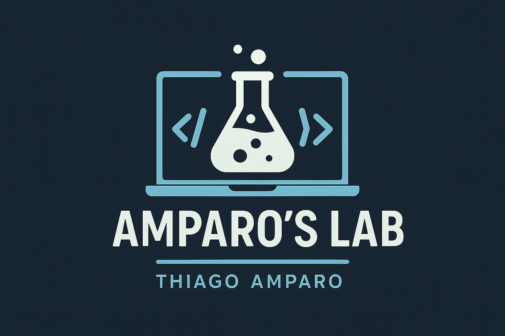

 

---

## 👨‍💻 Sobre mim

- 🎓 Graduação em Ciência da Computação  
- 🧠 Especialista em TI com foco em infraestrutura, desenvolvimento e segurança  
- 🛠️ Entusiasta em criar soluções eficientes, escaláveis e com mínimo uso de dependências  
- 🔒 Experiência em segurança, automação e manutenção de sistemas robustos  
- 🌍 Explorando novas tecnologias e soluções inovadoras  
- 🤝 Colaborativo, sempre buscando integração eficiente de sistemas  

###

  Graduado em Ciências da Computação e Especialista em Tecnologia da Informação, dediquei minha carreira ao domínio da tecnologia.   
  Acredito firmemente na importância da excelência técnica e na valorização da satisfação dos clientes.   
  Estou constantemente em busca de oportunidades para promover a inovação e melhorar continuamente os processos.   
  Visando uma abordagem colaborativa, considero a integração eficaz de sistemas e a entrega de soluções tecnológicas de alta qualidade aspectos centrais do meu trabalho.

 

---

## 💻 Tecnologias e Linguagens

### 🚀 Frameworks e Bibliotecas

### 🛠️ Ferramentas de Desenvolvimento

---

## 📊 GitHub Stats

  
  
  

---

## 🌐 Contato e Redes

  

  

